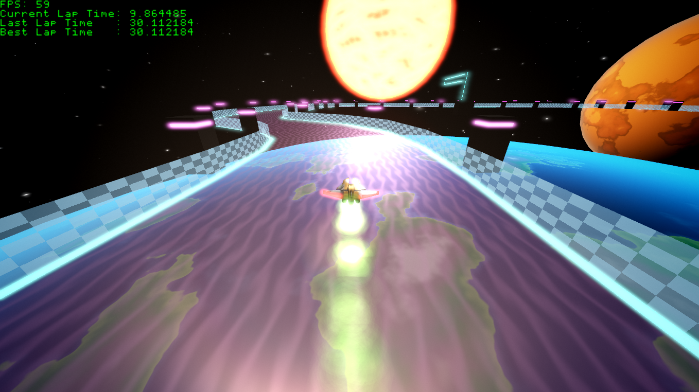
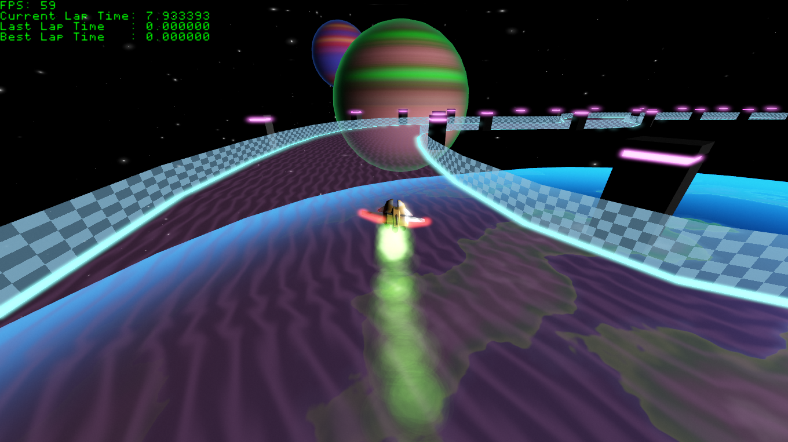

Solar System Racing

Videogame develope in C++ using D3D11 and XAudio2 with great focus on HLSL and shader programming

[Video Demo of Solar System Racing](https://www.youtube.com/watch?v=_oJ10vLunMU)

[Solar System Racing Itch](https://manutouzumaki.itch.io/solar-system-racing)

Features:

	-	Moder C++ and STL
	-	Assets Managers
	-	Shader Managers
	-	Variety of shading effects

Download the last Version from Releases
